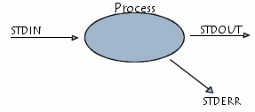

## Demystifying TTY

#### zhouxiaoqiang at [wisdomgarden.com](http://www.wisdomgarden.com)

---

## This talk will cover:

<br>

- Terms: Console, Terminal, TTY, Shell 
- A slightly deeper look at TTY
- Terminal Login Procedure
- Pseudo Terminal
- Network Login Procedure
- Terminal Emulator
- TTY and daemons

<br>

_Note: content and order may change_

---

## Process Standard input-output

<br>

input -> process -> output

<br>



---

## Terms

<br>

<span class="fragment">Terminal</span><span class="fragment">, Console</span><span class="fragment">, and TTY.</span>

<br>

***


***


***

### In unix terminology

<br> 

- TTY also means the device file representing the terminal
- Console is generally the primary terminal directly connected to a machine <!-- .element: class="fragment" -->

---

## A slightly deeper look at TTY

Note: tty, echo $$, ls -al /proc/[proc id], Alt + F[1-6]

---

## Terminal Login Procedure
<br>
```
                                +--------+
                                |  init  |
                                +---+----+
                                    |fork 
                                    v     
                                +---+----+
                                |  init  |
                                +---+----+
                                    |exec 
                                    v     
                                +---+----+
                                |  getty |
                                +--------+
```

***

<br>
```
                                +--------+
                                |  init  |
                                +---+----+
                                    |fork 
                                    v     
                                +---+----+
                                |  init  |
                                +---+----+
                                    |exec 
                                    v     
                                +---+----+
                                |  getty |
                                +--------+
                                    |exec 
                                    v     
                                +---+----+
                                |  login |
                                +--------+
```

***

```
                                +--------+
                                |  init  |
                                +---+----+
                                    |fork 
                                    v     
                                +---+----+
                                |  getty |
                                +--------+
                                    |exec 
                                    v     
                                +---+----+
                                |  login |
                                +--------+
                                    |clone 
                                    v     
                                +---+----+
                                |  bash  |
                                +--------+
```

---

## Controlling Terminal

<br>

- /dev/tty
- sigint

Note: sudo strace $$, stty -a

---

## nohup

Note: shopt -s huponexit