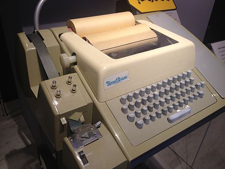
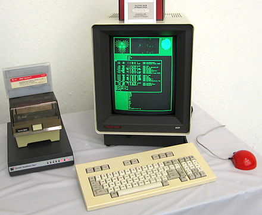

## Demystifying TTY

#### zhouxiaoqiang at [wisdomgarden.com](http://www.wisdomgarden.com)

---

## This talk will cover:

 

- Terminology: Console, Terminal, TTY, Shell 
- A slightly deeper look at TTY
- Terminal Login Procedure
- Pseudo Terminal
- Network Login Procedure
- Terminal Emulator
- TTY and daemons

 

_Note: content and order may change_

---

## Terms

 

Terminal, Console, and TTY.

 

***

***

***

### In unix terminology

  

- TTY also means the device file representing the terminal
- Console is generally the primary terminal directly connected to a machine <!-- .element: class="fragment" -->

